# The Core Concept: How the Actor and Critic Learn Together

This document explains the core learning loop for the Actor-Critic model. The key challenge in Reinforcement Learning is that there is no "ground truth" answer for what the best action is. The Actor-Critic model solves this by having two neural networks learn together in a two-phase process.

Let's use an analogy from your world of supply chain:
*   **The Actor** is a new **Junior Planner**. Their job is to look at the current inventory report (`State`) and decide on production/shipping numbers for the week (`Action`).
*   **The Critic** is a powerful **Forecasting Supercomputer**. Its job is to predict the **total end-of-year profit** (the `Q-Value`) based on the current inventory and the Junior Planner's proposed plan.

Both start out with random internal settings, so their initial decisions and forecasts are complete garbage. They get better through a two-phase process that repeats thousands of times.

---

## Phase 1: The Critic Learns to be a Better Forecaster

The Critic's goal is to become accurate at predicting the long-term value of any given `(State, Action)` pair. It learns by comparing its predictions to a slightly more realistic target.

**The Critic's Learning Loop:**

1.  **Make a Prediction:** The Critic looks at the current situation (`State₁`) and the Actor's proposed plan (`Action₁`). It makes a forecast for the total future profit.
    *   `Prediction₁ = Critic(State₁, Action₁)`  (e.g., $80,000)

2.  **Experience Reality:** The plan is executed for one week, and we get the real, immediate profit.
    *   `Real_Reward₁` (e.g., -$5,000)
    *   We also now know the inventory situation for the start of the next week, `State₂`.

3.  **Create a Better Target (The Bellman Equation):** The Critic calculates a new, improved forecast for the original situation.
    *   First, it gets a forecast for the *next* state's potential: `Future_Value = Critic(State₂, Actor(State₂))` (e.g., $82,000)
    *   Then, it combines reality with this new forecast: `Target = Real_Reward₁ + γ * Future_Value` (e.g., -$5,000 + 0.95 * $82,000 = $72,900)

4.  **Calculate Loss & Learn:** The Critic now has a clear error signal.
    *   `Critic_Loss = (Prediction₁ - Target)²` (e.g., ($80,000 - $72,900)²)
    *   It performs **backpropagation on its own network** to minimize this loss, making it a more accurate forecaster.

---

## Phase 2: The Actor Learns to be a Better Planner

The Actor's goal is simpler: **Make the Critic's forecast as high as possible.** It uses the Critic as a guide to find the direction of improvement.

**The Actor's Learning Loop:**

1.  **Propose a Plan:** The Actor looks at `State₁` and proposes `Action₁`.

2.  **Get a Score from the Critic:** The Actor's plan is fed into the now slightly-smarter Critic. The Critic outputs its score (the Q-Value).
    *   `Score = Critic(State₁, Action₁)` (e.g., $75,000)

3.  **Calculate Loss:** The Actor's loss is simply the negative of the Critic's score. The goal is to minimize this loss, which is the same as maximizing the score.
    *   `Actor_Loss = -Score` (e.g., -$75,000)

4.  **Find the Direction & Learn (Policy Gradient):** The backpropagation algorithm calculates the **gradient** of this loss. This gradient is the "direction of improvement." It tells the Actor how to adjust its weights to produce a new action that would have received a higher score from the Critic.
    *   The Actor performs **backpropagation on its own network**, nudging its weights in the direction of the gradient.

This two-step dance—the Critic getting better at forecasting, and the Actor using that forecast to find better plans—is what allows the system to learn a complex, profitable strategy from scratch.

---
## Visual Diagram of the Learning Loop

### Phase 1: Acting and Experiencing Reality

```mermaid
graph TD
    subgraph Phase 1: Acting & Experiencing
        S1["State at Start of Wk 1<br/>(e.g., Stocks = [0,0,0,0])"] --> A["Actor Network"];
        S1 --> C["Critic Network"];
        
        A -- Takes State S1 --> A_out(Action for Wk 1<br/>e.g., [18.2, 15.7,...]);
        
        A_out -- Actor's proposed action --> C;
        
        C -- Takes State S1 and Action A1 --> C_out("Critic's Initial Prediction<br/>(e.g., $80,000)");

        A_out --> E["Environment (step function)"];
        S1 --> E;
        
        E --> R1["Real Reward for Wk 1<br/>(e.g., -$5,000)"];
        E --> S2["State at Start of Wk 2<br/>(New inventory levels)"];
    end
```

### Phase 2: Learning from the Experience

```mermaid
graph TD
    subgraph "Step 2a: The Critic Learns"
        S2["State at Start of Wk 2"] --> A2["Actor Network"];
        A2 -- Proposes best action for S2 --> A2_out["Action_2"];
        
        S2 --> C2["Critic Network"];
        A2_out --> C2;
        
        C2 --> V2["Predicted Future Value from S2<br/>(e.g., $82,000)"];
        
        R1["Real Reward for Wk 1<br/>(-$5,000)"] --> Calc["Calculate Target"];
        V2 --> Calc;
        
        Calc -- "Target = R1 + γ * V2" --> T["Bellman Target<br/>(e.g., $72,900)"];
        
        C_out["Critic's Initial Prediction<br/>($80,000)"] --> L_C["Calculate Critic's Loss"];
        T --> L_C;
        
        L_C -- "Error = (Prediction - Target)²" --> B_C["Backpropagate Critic"];
        
        B_C --> C_update("Updated Critic Network");
    end

    subgraph "Step 2b: The Actor Learns"
        S1_A["State at Start of Wk 1"] --> A_Learn["Actor Network"];
        A_Learn --> A1_Learn["Action_1"];
        
        S1_A --> C_Guide["Updated Critic Network"];
        A1_Learn --> C_Guide;
        
        C_Guide --> Score["Critic's Score for Action_1"];
        
        Score --> L_A["Calculate Actor's Loss<br/>Loss = -Score"];
        
        L_A --> B_A["Backpropagate Actor (Policy Gradient)"];
        
        B_A --> A_update("Updated Actor Network");
    end
```


