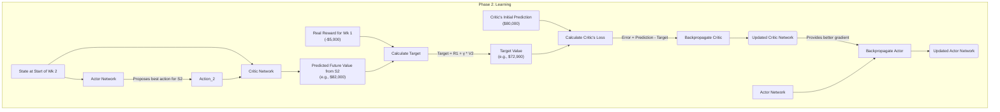

# The Crux Concept: How the Actor and Critic Learn

This document explains the core learning loop for the Actor-Critic model, focusing on how the two neural networks (Actor and Critic) learn from experience when there is no "ground truth" answer.

## The Core Problem

In supervised learning, we have a clear target. For Reinforcement Learning, we do not. The fundamental question is: **How do the networks learn what a "good" action is?**

The answer is that they learn by comparing the Critic's prediction to a slightly more realistic target built from real experience. This process is based on the Bellman Equation.

## The Bellman Equation as a Learning Target

The value of taking an action (`A₁`) in a certain state (`S₁`) is defined as the immediate reward you get, plus the discounted value of the state you land in (`S₂`).

`Value(S₁, A₁) = (Immediate Reward for S₁, A₁) + γ * (Value of the best possible future from S₂)`

The algorithm uses this equation to create a **Target Value** for the Critic's prediction.

`Target_Value = Immediate_Reward + γ * Predicted_Value_of_Next_State`

- **Immediate_Reward**: The real, factual profit/loss from the current week. This is the "ground truth" part of our target.
- **γ (gamma)**: The discount factor (e.g., 0.95). It makes future rewards slightly less valuable than immediate ones.
- **Predicted_Value_of_Next_State**: The Critic's own best guess for the value of the next state. While this part is a guess, it's combined with the real reward to create a target that is *one step closer to reality* than the original prediction.

## The Visual Flow of a Single Learning Step

The following diagram shows the two-phase process for a single step (e.g., Week 1).

### Phase 1: Acting and Experiencing Reality

```mermaid
graph TD
    subgraph Phase 1: Acting & Experiencing
        S1["State at Start of Wk 1<br/>(e.g., Stocks = [0,0,0,0])"] --> A["Actor Network"];
        S1 --> C["Critic Network"];
        
        A -- Takes State S1 --> A_out(Action for Wk 1<br/>e.g., [18.2, 15.7,...]);
        
        A_out -- Actor's proposed action --> C;
        
        C -- Takes State S1 and Action A1 --> C_out("Critic's Initial Prediction<br/>(e.g., $80,000)");

        A_out --> E["Environment (step function)"];
        S1 --> E;
        
        E --> R1["Real Reward for Wk 1<br/>(e.g., -$5,000)"];
        E --> S2["State at Start of Wk 2<br/>(New inventory levels)"];
    end
```

### Phase 2: Learning from the Experience



### Summary of the Learning Process

1.  **Act & Predict**: The Actor chooses an action, and the Critic predicts the value of that action. Both are initially random guesses.
2.  **Experience Reality**: The action is taken in the environment, which returns a real, immediate reward and the next state.
3.  **Calculate a Better Target**: The Critic uses the real reward and its own (improving) prediction of the next state's value to calculate a new `Target_Value`. This target is slightly more accurate than its original prediction.
4.  **Critic Learns**: The Critic updates its network using backpropagation to reduce the error between its original prediction and the new target.
5.  **Actor Learns**: The Actor updates its network using backpropagation, guided by the now-smarter Critic, to choose actions that lead to higher value predictions.

This cycle repeats thousands of times, and both networks slowly improve together.
